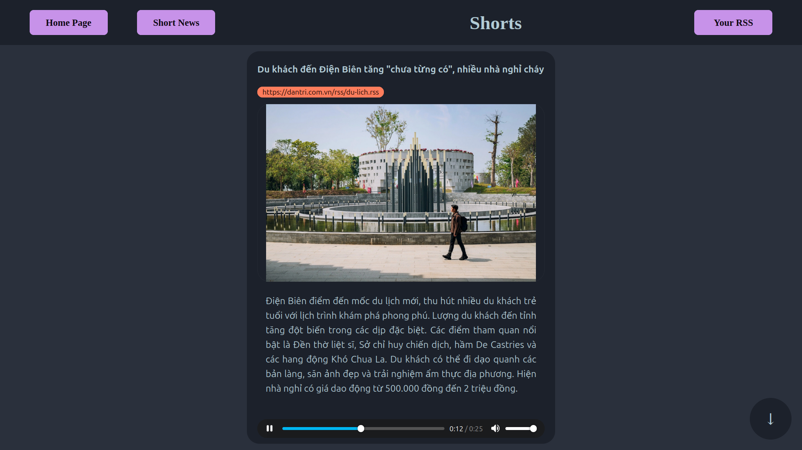

# 📰 ShortNews - AI Enhanced RSS News App with Ollama and PiperTTS  

<figure>
    
    <figcaption>Example: ShortNews page shorts</figcaption>
</figure>

1. Introduction

ShortNews is created for busy people. Add your rss of choice and you can read/listen to the summary of news article. 

2. Dependencies:

* [Ollama](https://ollama.com/) installed required.
* [PiperTTS](https://github.com/rhasspy/piper) and [gemma:2b](https://ollama.com/library/gemma) llm model will be installed using installation script.

3. Features:

* Crawl news from RSS source.
* Use Ollama to create a summary.
* Create audio using PiperTTS with summarized text.
* Store summary and audio in sqlite database.
* Add/Delete news source of choice.
* View full article, listen to audio
* Short news with autoplay.

4. Language support:
* Currently English, Vietnamese.

5. Installation:
* Install [Ollama](https://ollama.com/) then:

    * Linux: run **install.sh** script. When finished, just run ***short_news.bin***

    * Windows: run **install.bat** script. When finished, just run ***short_news.exe***
    * A browser will be open with http://localhost:8000 for the app
* **Warning:** short_news currently will reserve port 8000 (may fix in the future). Please check for system requirements of [gemma:2b](https://ollama.com/library/gemma) model before install, we are using q4_0 version.

6. Tech-stack:
* Backend Api is build using [net/http](https://pkg.go.dev/net/http) std lib in golang, using [gofeed](https://github.com/mmcdole/gofeed) library for crawling rss feeds, [goquery](https://github.com/PuerkitoBio/goquery) for crawling article data and [go-sqlite3](github.com/mattn/go-sqlite3) to for sqlite database.
* Front-end in [Svelte](https://svelte.dev/) and built as a single page app.
* Langchain + Ollama for calling [gemma:2b](https://ollama.com/library/gemma) model
* Using [PiperTTS](https://github.com/rhasspy/piper) binary and cli execution to get audio.